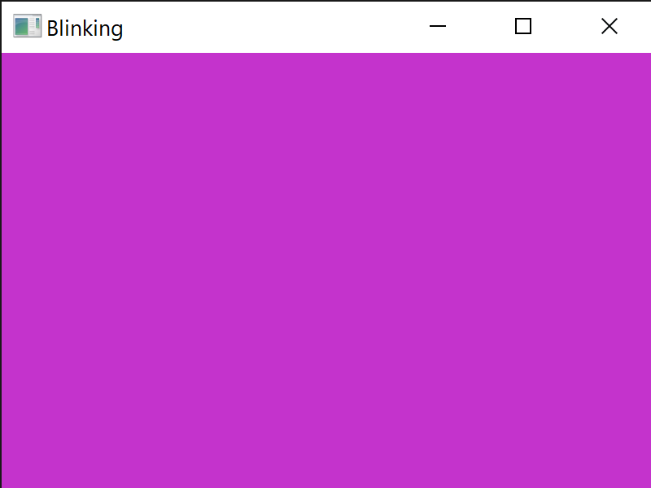
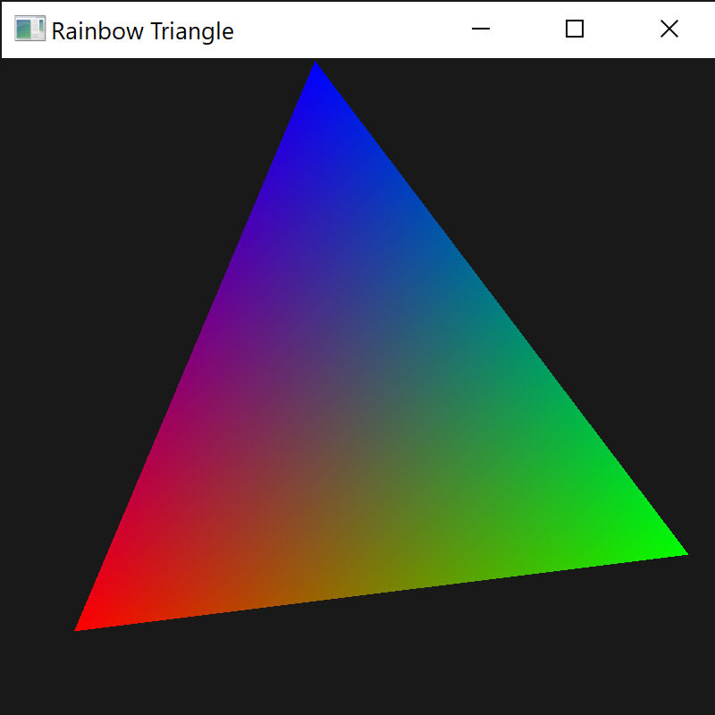
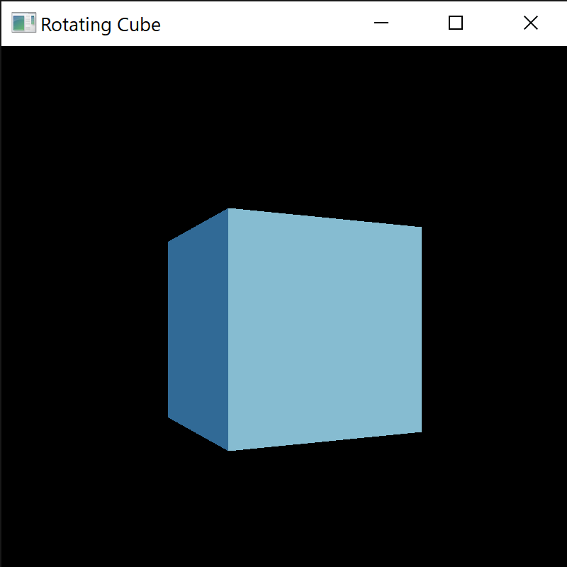

# A collection of introductory OpenGL programs in Odin.

The programs below demonstrate illustrate OpenGL functions in Odin using the wrappers in "vendor:OpenGL". The programs start very basic and get progressively more complicated.

The glfw library wrappers for Odin are also illustrated.

## [Blinking Pink](./Blinking-Pink)

A window which oscillates between pink and blue.

## [Rainbow Triangle](./Rainbow-Triangle)

An RGB triangle which rotates over time.

## [Rotating Cube](./Rotating-Cube)

A cube with different faces which rotates over time.

